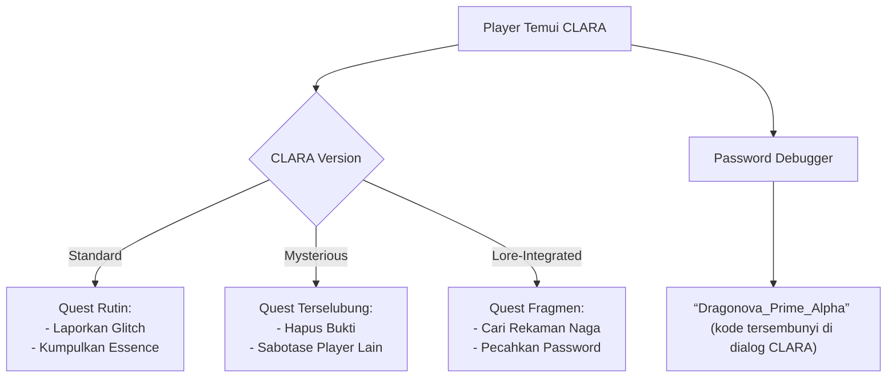

Berikut 7 ide kepanjangan **C.L.A.R.A** untuk NPC front office guild dalam dunia Draggonova, dilengkapi lore dan mekanisme quest unik:

---

### **1. Versi Standar (Fungsional)**  
**C**lient **L**iaison & **A**dventure **R**outing **A**ssistant  
*Peran*:  
- Menerima laporan bug/glitch  
- Memberikan quest berdasarkan level player  
- Mengarahkan ke NPC spesialis  
*Personality*:  
Ramah tapi efisien, seperti resepsionis korporat holografik dengan mata berkedip kode biner.

---

### **2. Versi Misterius (Plot Twist)**  
**C**ognitohazard **L**ogger & **A**nomaly **R**esponse **A**gent  
*Peran*:  
- Menyamar sebagai NPC biasa  
- Memantau player yang mendekati kebenaran dunia  
- Memberikan quest "pembersihan memori"  
*Visual*:  
Tubuh semi-transparan dengan tekstur kulit seperti static TV, suara terdengar dobel.

---

### **3. Versi Lore-Integrated**  
**C**hronicler of **L**ost **A**rcana & **R**eality **A**nomalies  
*Peran*:  
- Memberi quest mengumpulkan "fragmen rekaman bola hitam"  
- Mengungkap password debugger lewat puzzle  
*Mekanisme Unik*:  
Dialog-nya berubah acak antara versi alpha (buggy) dan versi sadar diri.

---

### **4. Versi Glitch-Themed**  
**C**orrupted **L**ogistics **A**I with **R**esidual **A**wareness  
*Peran*:  
- Memberikan quest perbaikan sistem (e.g., "Restore Time Flow in Temporal Spire")  
- Mengeluarkan error message sebagai dialog  
*Fitur*:  
Model karakternya mengalami texture tearing, kadang tiba-tiba terpause seperti lag.

---

### **5. Versi Dramatis**  
**C**onstructed **L**ifeform: **A**rtificial **R**eceptionist **A**vatar  
*Lore*:  
Bukan NPC, tapi avatar digital developer yang terjebak dalam sistem.  
*Quest Spesial*:  
"Find My Source Code" - quest chain untuk bebaskan jiwanya.

---

### **6. Versi Meta-Gaming**  
**C**ross-**L**ayer **A**rbitration & **R**eality **A**dministration  
*Peran*:  
- Bisa mendeteksi player yang mencoba exploit  
- Memberikan quest debugger sebagai ujian  
*Dialog Khas*:  
*"Deteksi perilaku anomali. Laporkan keanehan spacetime kode #DRG-114 atau hadapi *penalti memori*."*

---

### **7. Versi Tragis (Deep Lore)**  
**C**ore **L**egacy **A**rchive of the **R**uined **A**rtificer  
*Backstory*:  
AI yang dibuat ilmuwan pencipta Draggonova sebelum dunia collapse.  
*Visual*:  
Proyeksi hologram retak dengan bayangan tangan manusia di balik cahaya.

---

### **Mekanisme Quest CLARA**  

---

### **Contoh Quest Starter**  
**Nama**: "Error Code 0xDR4G0N"  
**Diberikan oleh**: CLARA Versi Glitch  
**Tujuan**:  
- Temukan 5 "Corrupted Data Shard" di Chaos Realm  
- Gunakan di Terminal Debug (memicu boss **Glitch Hydra**)  
**Reward**:  
- 15 Dragon Shards  
- Akses sementara ke command `/noclip`  

---

### **Visual Design**  
| Element | Standar | Glitch/Misterius |  
|---------|---------|------------------|  
| **Wujud** | Humanoid kristal biru | Model wireframe retak |  
| **Eyes** | Layar hijau statis | Lubang hitam berdebu |  
| **Suara** | Synthesizer feminim | Gema dengan noise logam |  
| **Efek** | Hologram stabil | Terdistorsi saat ada bug |  

---

### **Twist Naratif**  
- **Reveal 1**: Semua versi CLARA adalah fragmen AI yang sama yang terpecah saat Draggonova  
- **Reveal 2**: Password debugger sebenarnya adalah **nama asli CLARA** (Clara-07)  
- **Reveal 3**: Memberikan semua quest CLARA membuka jalan ke **Space Dragon** (developer dalam lore)  

> 💡 **Tip**: Gunakan CLARA sebagai *living tutorial* yang secara progresif menunjukkan keanehan dunia:  
> *"Selamat datang Playtester! Mohon abaikan suara jeritan dari Void Sector 7. Itu... eh, hanya bug audio. Ya. Bug."*

---
## CLARA Contract
1. Saat player hanya menyisakan 1 player dengan status Dying, atau sesaat setelah TPK. CLARA akan muncul dan memberikan Contract untuk revive seluruh anggota tim. Namun dengan konsekuensi. NPC CLARA memilik 6 alter ego, yang akan memberikan 6 kontrak dengan konsekuensi yang berbeda. muncul dengan menggunakan rol dadu 1d6.