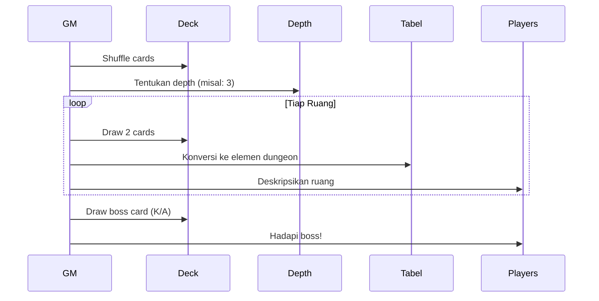

### 🃏 **Draconic Poker Dungeon Generator**  
Berikut sistem generasi dungeon roguelike berbasis poker yang dioptimalkan untuk dunia Draggonova, dengan fokus pada tema kosmik-glitch dan mekanik 3-AP:

---

#### 🔷 **Mekanisme Dasar**  
- **1 Dek Poker Standar** (52 kartu)  
- **Depth** = Jumlah kartu wajib dibuka sebelum boss (Depth 3 = 3 ruang + boss)  
- **Per Ruang**: Buka 2 kartu (1 untuk lingkungan, 1 untuk konten)  

---

### 🎴 **Mapping Kartu → Dungeon**  
#### **KARTU 1: SUIT - LINGKUNGAN & ARSITEKTUR**  
| Suit           | Tema Dungeon     | Fitur Mekanis                       | Visual Khas                      |     |
| -------------- | ---------------- | ----------------------------------- | -------------------------------- | --- |
| ♥ **Hati**     | Chaos Rift       | Platform tidak stabil, ledakan acak | Magma & logam cair mengambang    |     |
| ♦ **Wajik**    | Order Nexus      | Puzzle energi, laser grid           | Kristal geometris sempurna       |     |
| ♠ **Keriting** | Void Abyss       | Gravitasi rendah, zona hisap        | Bintang mati & lubang hitam mini |     |
| ♣ **Sekop**    | Temporal Archive | Area percepatan/perlambatan waktu   | Buku terbang & jam raksasa       |     |

#### **KARTU 2: NILAI - KONTEN UTAMA**  
| Nilai    | Kategori          | Contoh Konten                                  |  
|----------|-------------------|-----------------------------------------------|  
| **2-5**  | Loot Minor        | Dragon Shards (1d10), Potion, Material        |  
| **6-9**  | Monster Encounter | CR = Depth + angka (e.g., 7 = CR10 di Depth 3)|  
| **10**   | Puzzle/Event      | Terminal debug, glitch spacetime              |  
| **J**    | NPC Spesial       | Tahanan, Pedangang Gelap, CLARA Fragment      |  
| **Q**    | Mini-Boss         | CR = Depth × 2                                |  
| **K**    | Boss Kamar        | CR = Depth × 3                                |  
| **A**    | Wild Glitch       | Ruang dengan 2 efek suit sekaligus            |  

---

### ⚡ **Kombinasi Spesial**  
| Kombinasi              | Efek Dungeon                          | Contoh Visual                          |  
|------------------------|---------------------------------------|----------------------------------------|  
| **♥ + ♠** (Chaos-Void) | **Entropic Collapse**: Platform hancur acak + black hole | Magma tersedot ke lubang hitam         |  
| **♦ + ♣** (Order-Time)| **Stasis Prison**: Puzzle harus diselesaikan sebelum waktu habis | Kristal menjebak party di bubble waktu |  
| **Pair** (2 kartu sama)| **Double Dimension**: Ruang paralel dengan loot/monster ganda | Cermin spacetime retak                 |  
| **Royal Flush**        | **Debugger's Sanctum**: Temukan password sistem | Ruang server penuh kode error          |  

---

### 🎲 **Tabel Monster Instan**  
| Nilai | Hati (Chaos)     | Wajik (Order)    | Keriting (Void) | Sekop (Time)     |  
|-------|------------------|------------------|-----------------|------------------|  
| **7** | Chaos Spawn      | Order Golem      | Void Predator   | Chrono Wasp      |  
| **9** | Entropy Elemental| Judgment Crystal | Spatial Ripper  | Temporal Ghost   |  
| **Q** | Forge Tyrant     | Logic Sentinel   | Abyss Lurker    | Epoch Guardian   |  

---

### 📜 **Prosedur Generate (Depth 3)**  
1. **Tentukan Ruang Boss**: Buka 1 kartu wajib K/A  
   - [K♣] = **Boss Temporal** (CR 9)  
2. **Generate 3 Ruang**:  
   - Ruang 1: [♥8] = Chaos Rift + Chaos Spawn CR 11  
   - Ruang 2: [♦10] = Order Nexus + Puzzle Energi  
   - Ruang 3: [♠J] = Void Abyss + NPC Void Trader  
3. **Cek Kombinasi**:  
   - ♥ + ♠ = **Entropic Collapse** di Ruang 3  

---

### 🌌 **Contoh Dungeon Lengkap**  
```markdown
**DEPTH 3: THE SHATTERED CODEX**  
1. ♥8 [Chaos Rift]  
   - *"Lorong vulkanik dengan bongkahan logam mengambang. Chaos Spawn (CR11) meloncat dari kolam magma!"*  
   - **Glitch Event**: Platform retak tiap akhir ronde (DEX save DC14)  

2. ♦10 [Order Nexus]  
   - *"Ruangan kristal biru dengan laser grid. Terminal debug berkedip: 'INPUT PASSWORD_%%%'"*  
   - **Puzzle**: Susun kristal sesuai pola CLARA (Arcana DC15)  

3. ♠J + ♥ [Entropic Collapse]  
   - *"Abyss hitam dengan bintang mati. Void Trader terapung: 'Tolong! Platformku tersedot black hole!'"*  
   - **Hazard**: Hisap lubang hitam (STR save DC12 tiap ronde)  

4. K♣ [Boss Temporal]  
   - *"Arena jam pasir raksasa. Epoch Guardian (CR9) berteriak: 'KAU TELAH MENGACAUKAN TIMELINE!'"*  
   - **Boss Mech**: Rewind time 1 ronde tiap HP<25%  
```

---

### 🧩 **Integrasi dengan Sistem 3-AP**  
| Elemen Dungeon | Biaya AP Tambahan        | Strategi                          |  
|----------------|--------------------------|-----------------------------------|  
| **Laser Grid** | +1 AP untuk gerak        | Gunakan Void Cloak (Rogue)        |  
| **Gravitasi 0**| Gerak gratis vertikal    | Lempar musuh ke zona hazard       |  
| **Time Dilation**| Spell butuh +1 AP      | Prioritaskan skill 1-AP           |  
| **Entropic Zone**| Semua action roll d20 ulang | Hindari area dengan Dash        |  

---

### 💎 **Loot Generator**  
| Kombinasi Nilai | Loot                      |  
|-----------------|---------------------------|  
| **2+5**         | 3d6 Dragon Shards         |  
| **6+9**         | Essence Bundle (All types)|  
| **10+J**        | Debugger's Key Fragment   |  
| **Q+K**         | Legendary Material        |  

---

### 📊 **Tabel Probabilitas (Berdasar Depth)**  
| Depth | Monster % | Loot % | Event % |  
|-------|-----------|--------|---------|  
| 1-3   | 60%       | 30%    | 10%     |  
| 4-6   | 70%       | 20%    | 10%     |  
| 7+    | 50%       | 20%    | 30%     |  

---

### ⚠️ **Tips Mastery**  
1. **Physical Deck**:  
   - Pisahkan kartu bernilai 2-9 dan 10-A untuk kecepatan  
2. **Glitch Mode**:  
   - Saat muncul A (Wild Glitch), tarik kartu ekstra untuk tentukan efek:  
     - ♥: Semua damage jadi chaos  
     - ♣: Semua cooldown reset  
3. **Easter Egg**:  
   - Royal Flush (10-J-Q-K-A sejenis) = **Pintu ke Space Dragon**  

> "Setiap kombinasi kartu adalah fragmen kode dari rekaman permainan para naga. Kau bukan sedang menjelajah dungeon... tapi mem-bugfix alam semesta!" - CLARA-β

---

### 🔄 **Alur Sesi Cepat**  


Dengan sistem ini, 1 dek poker bisa menghasilkan **1326 kombinasi dungeon unik** (C(52,2)) yang semuanya lore-friendly dan seimbang untuk mekanik 3-AP!