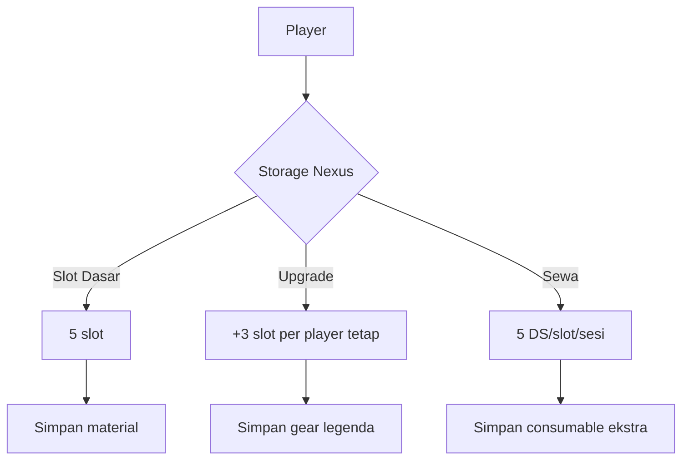

### 📜 **Tabel Lengkap Item Draggonova**  
Berikut kumpulan semua item yang disebutkan dalam campaign, dilengkapi efek, harga Dragon Shards (DS), dan sumber perolehan:

| **Nama Item**               | **Tipe**       | **Efek/Kegunaan**                                                                 | **Harga (DS)** | **Sumber**                     |
|-----------------------------|---------------|-----------------------------------------------------------------------------------|----------------|--------------------------------|
| **Dragon Shards (DS)**      | Mata Uang     | Mata uang utama untuk beli/upgrade                                                | -              | Drop monster, quest            |
| **Raw Time Essence**        | Material      | Material craft item temporal                                                      | 5/unit         | Drop Chrono-Slime              |
| **Raw Space Essence**       | Material      | Material craft item spatial                                                       | 5/unit         | Drop Spatial Weaver            |
| **Raw Chaos Essence**       | Material      | Material craft item chaos                                                         | 5/unit         | Drop Chaos Golem              |
| **Raw Order Essence**       | Material      | Material craft item order                                                         | 5/unit         | Drop Null Priest              |
| **Fractal Carapace**        | Material      | Material utama craft Bag of Holding                                               | 30             | Drop Spatial Weaver            |
| **Stabilized Void Essence** | Material      | Material langka craft Bag of Holding                                              | 100            | Drop Void Serpent              |
| **Chaos Core**              | Material      | Craft senjata chaos damage acak                                                   | 40             | Drop Chaos Golem              |
| **Shattered Vinyl**         | Material      | Craft Instrument of Illusions                                                     | 25             | Drop Echo Soloist              |
| **Chronal Ooze**            | Material      | Upgrade gear temporal                                                             | 20             | Drop langka Chrono-Slime       |
| **Corrupted Data Shard**    | Material      | Craft scroll "glitch spell"                                                       | 15             | Drop Glitch Hound              |
| **Data Seed**               | Material      | Craft item teknologi                                                              | 20             | Drop Glitch Treant             |
| **Encryption Key**          | Quest Item    | Buka terminal rahasia                                                             | -              | Drop Debug Spider              |
| **Bag of Holding**          | Equipment     | Penyimpanan ekstra (40 ft³)                                                       | 150            | Craft: 3 Fractal Carapace + 1 Stabilized Void Essence + 50 DS |
| **Bag of Holding (Upgraded)**| Equipment     | +50 lb kapasitas                                                                  | 70             | Upgrade: 20 Raw Space Essence + 30 DS |
| **Void Chill Bag**          | Upgrade       | Simpan item perishable tanpa busuk                                               | 40             | Upgrade Bag of Holding         |
| **Pocket of Order**         | Equipment     | Ambil item sebagai bonus action                                                   | 120            | Craft: 30 Raw Order Essence + 40 DS |
| **Chaotic Sack**            | Equipment     | Ambil item acak (roll d6)                                                         | 90             | Craft: 25 Raw Chaos Essence + 30 DS |
| **Potion of Haste**         | Consumable    | +1 AP sementara (3 ronde)                                                         | 30             | Craft: 3 Raw Time Essence + 10 DS |
| **Chrono Armor**            | Armor         | AC 14, 1x/hari re-roll initiative                                                | 200            | Craft: 5 Raw Time Essence + 1 Chronal Ooze + 80 DS |
| **Instrument of Illusions** | Equipment     | Buat ilusi suara (DC 15) 3x/hari                                                 | 180            | Craft: Shattered Vinyl + 50 DS |
| **Void Beacon**             | Consumable    | Teleport party ke Nexus (selamatkan loot)                                        | 50             | Beli di Nexus                  |
| **Chronal Anchor**          | Equipment     | Tandai lokasi untuk respawn                                                       | 80             | Craft: 3 Raw Time Essence + 30 DS |
| **Sword of Primordials**    | Senjata       | 2d8 damage + 1d6 tipe acak (roll d4)                                             | 300            | Drop boss legenda              |
| **Sigil of Absolute Order** | Aksesori      | Aktifkan antimagic field 10 ft radius 1x/hari                                   | 250            | Craft: loot Null Priest        |
| **Reality Stabilizer**      | Consumable    | 50% hapus 1 konsekuensi kontrak CLARA                                            | 150            | Drop mini-boss                 |
| **Contract Nullifier**      | Meta-Upgrade  | Hapus 1 kontrak CLARA permanen                                                   | 300            | Beli di Nexus                  |
| **Void Eraser**             | Consumable    | Hapus 1 konsekuensi kontrak CLARA (100%)                                         | 200            | 5% drop dari boss              |
| **Shadow Step Infusion**    | Skill Upgrade | Teleport 40 ft (gantikan Voidstep)                                               | 150            | Quest "Recover Lost Data"      |
| **Dagger of Time Skip**     | Senjata       | Reaksi: Teleport 10 ft setelah diserang 1x/hari                                  | 120            | Soul Echo drop                 |
| **Glitch Weapon**           | Senjata       | 1x/sesi ubah damage jadi force                                                   | -              | Konsekuensi kontrak CLARA-β    |
| **Temporal Recall**         | Meta-Upgrade  | 1x/sesi ulang 1 roll attack/saving throw                                         | 30             | Beli di Nexus                  |
| **Chaos Infusion**          | Meta-Upgrade  | Senjata utama +1d4 damage acak                                                   | 40             | Beli di Nexus                  |
| **Spatial Fold**            | Meta-Upgrade  | 1x/hari teleport party 30 ft                                                     | 50             | Beli di Nexus                  |
| **Oathbound Armor**         | Armor         | +2 AC saat bertarung sesuai prinsip karakter                                    | 180            | Reward roleplay-in-combat      |
| **Mercy's Sigil**           | Aksesori      | +1 AC vs musuh yang pernah ditolong                                              | 90             | Reward roleplay-in-combat      |

---

### 🧾 **Keterangan Tambahan**  
1. **Harga Bazaar**:  
   - Harga bisa berfluktuasi ±20% tergantung supply-demand antar player  
   - Contoh: Bag of Holding bisa dijual 180 DS (jika langka) atau 120 DS (jika surplus)  

2. **Item Legenda**:  
   - Tidak bisa dibeli, hanya didapat dari:  
     - Kontrak CLARA-Prime  
     - Drop boss Depth 10+  
     - Quest epik  

3. **Meta-Progression**:  
   - Item dengan label "Meta-Upgrade" bersifat permanen dan melekat ke akun player  

4. **Konsekuensi Item**:  
   - Item corrupt (seperti **Glitch Weapon**) punya 10% chance malfunction:  
     _Contoh: Glitch Weapon bisa menyebabkan 1d6 self-damage saat crit fail_  

---

### 📦 **Contoh Inventory di Nexus**  

> 💡 **Tip**: Gunakan physical item cards untuk loot agar ekonomi terasa lebih nyata!
