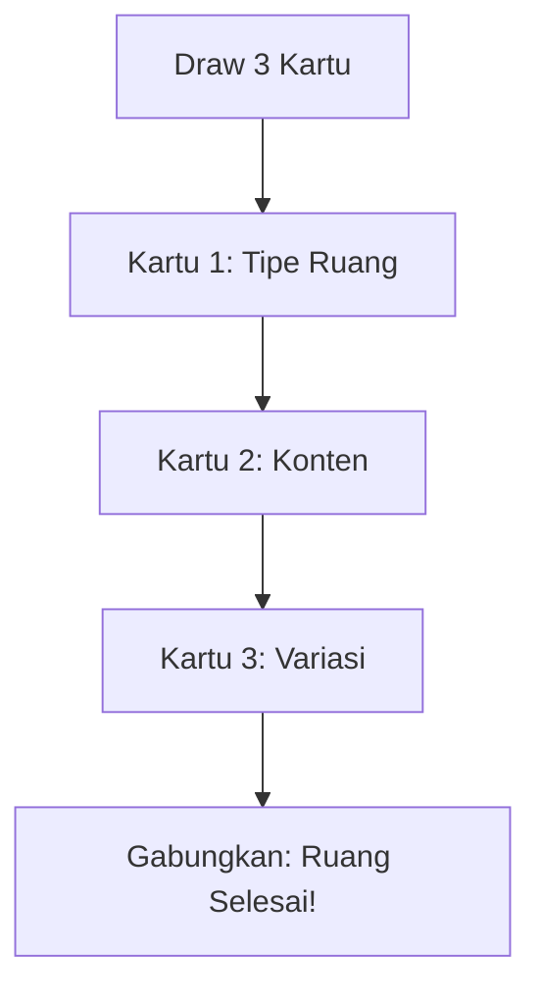

Berikut sistem **dungeon generator roguelike berbasis kartu poker** untuk campaign Draggonova Anda. Sistem ini menggunakan **1 dek poker standar (52 kartu + 2 Joker)** sebagai *seed* procedural, dengan setiap kartu memetakan elemen dungeon, monster, loot, dan event unik.

---

### **Mekanisme Dasar**
1. **Siapkan 1 dek poker**. 
2. **Tentukan "Depth" Dungeon** (jumlah ruangan):
   - Depth 1-5: 5 ruang
   - Depth 6-10: 7 ruang
   - Depth 11+: 9 ruang
3. **Draw kartu** berurutan untuk setiap ruang (3 kartu/ruang).

---

### **Mapping Kartu → Elemen Dungeon**
#### **KARTU PERTAMA: TIPE RUANGAN** (Suit)  
| Suit           | Tipe Ruangan     | Koneksi         | Fitur Khusus                   |
| -------------- | ---------------- | --------------- | ------------------------------ |
| **♥ Hati**     | Chaos Shrine     | 1-2 pintu       | Perangkap acak, loot berisiko  |
| **♦ Wajik**    | Order Archive    | 1 pintu (kunci) | Puzzle, loot terprediksi       |
| **♠ Keriting** | Void Corridor    | 3+ pintu        | Monster ambush, jalan pintas   |
| **♣ Sekop**    | Temporal Gallery | 1 pintu         | Time-warp, efek durasi panjang |

#### **KARTU KEDUA: KONTEN RUANGAN** (Nilai)  
| Nilai Kartu | Monster (CR)       | Trap/Loot               | Event Glitch Draggonova        |
| ----------- | ------------------ | ----------------------- | ------------------------------ |
| **2-5**     | -                  | Minor Loot (d100 gp)    | Suara rekaman naga terdistorsi |
| **6-10**    | Monster CR = Depth | Trap (DC 12-15)         | Gravitasi lokal berubah        |
| **J-Q**     | Mini-Boss (CR+1)   | Major Loot (magic item) | Portal ke ruang lain terbuka   |
| **K-A**     | Boss (CR+2)        | Legendary Fragment      | Hukum fisika rusak 1d4 ronde   |
| **Joker**   | -                  | Dragon Shards x5        | **System Reboot!** (reset AP)  |

#### **KARTU KETIGA: VARIASI** (Kombinasi Warna-Nilai)  
- **Merah** (♥/♦): Efek menguntungkan (e.g., +1 AP sementara, heal)  
- **Hitam** (♠/♣): Efek merugikan (e.g., -1 AP, spawn monster tambahan)  
- **Nilai Kartu**: Skala efek (e.g., 3 = minor, A = major)  

---

### **Contoh Generate Dungeon (Depth 3)**  
**Draw Kartu:**  
1. Ruang 1: [ **K♠** | **7♦** | **2♥** ]  
   - **K♠**: Void Corridor (3 pintu)  
   - **7♦**: Monster CR 3 (*Chrono-Slime*)  
   - **2♥**: Efek minor (+1 AP untuk 1 pemain)  
   *Deskripsi: Lorong gelap dengan dinding berkedip. Chrono-Slime menetes dari langit-langit. Energi merah menyelimuti rogue.*  

2. Ruang 2: [ **♦5** | **Q♣** | **Joker** ]  
   - **♦5**: Order Archive (1 pintu berkunci)  
   - **Q♣**: Mini-Boss CR 4 (*Null Priest*) + Major Loot  
   - **Joker**: **SYSTEM REBOOT!** Semua AP reset penuh.  
   *Deskripsi: Ruang arsip berisi rak kristal. Null Priest menjaga peti. Lampu ruang tiba-tiba mati lalu menyala—semua merasa segar!*  

3. Ruang 3: [ **♥A** | **K♥** | **9♠** ]  
   - **♥A**: Chaos Shrine (2 pintu)  
   - **K♥**: Boss CR 5 (*Chaos Golem*) + Legendary Fragment  
   - **9♠**: Efek merugikan (-1 AP untuk semua musuh ronde pertama)  
   *Deskripsi: Kuil kacau dengan patung naga terbelah. Chaos Golem bangkit dari altar. Energi hitam melemahkannya sementara.*  

---

### **Tabel Monster Cepat (Berdasar Depth)**  
| Depth | Monster (CR)       | Loot                    |
| ----- | ------------------ | ----------------------- |
| 1-3   | Chrono-Slime (2)   | Time Essence            |
| 4-6   | Spatial Weaver (4) | Fractal Carapace        |
| 7-9   | Echo Soloist (5)   | Shattered Vinyl         |
| 10+   | Void Serpent (7)   | Stabilized Void Essence |

---

### **Sistem "Glitch Deck" (Joker & Kartu Spesial)**  
- **Joker Hitam**: Aktifkan **"Corrupted Save File"**  
  - Muncul monster dari rekaman permainan naga (e.g., **Space Dragon Fragment** CR 10).  
- **Joker Merah**: Aktifkan **"Debug Mode"**  
  - Semua pemain dapat **meta-upgrade sementara** (e.g., +2 AP, immunity glitch).  
- **Kartu Face (J/Q/K) Identik**: Buka **Secret Room**  
  - e.g., [J♠ + J♣] = Ruang tersembunyi berisi *Dragon Egg* (crafting epic).  

---

### **Tips Implementasi**  
1. **Physical Tool**: Gunakan dek poker fisik—GM cukup draw kartu saat sesi.  
2. **Adaptif**:  
   - Kartu tinggi (9-A) di awal dungeon? Naikkan CR monster.  
   - Terlalu banyak ♠? Tambah ambush/trap.  
3. **Visual**:  
   - ♥ = Ruang merah berdebu | ♦ = Ruang kristal simetris  
   - ♠ = Lorong pecah kaca hitam | ♣ = Ruang hijau kabut temporal  
4. **Scaling**:  
   - Depth 1: Monster HP x0.5  
   - Depth 10: Monster HP x2.0, damage +50%  

Dengan sistem ini, Anda bisa generate **dungeon roguelike unik dalam 30 detik** dengan lore terintegrasi:  
- **Kartu As** = Ledakan Draggonova  
- **Joker** = System crash bola hitam  
- **Suit** = Jejak 4 Naga Primordial  

Bawa dek poker ke sesi DnD berikutnya, dan biarkan kartu menentukan nasip para Shard of Draggonova! 🃏⚡